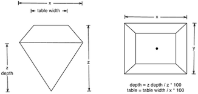

```{r setup , include=FALSE}
knitr::opts_chunk$set(echo = TRUE, 
                      size = "footnotesize",
                      comment = NA,
                      warning = FALSE,
                      message = FALSE,
                      fig.align = "center",
                      fig.width = 8, 
                      fig.height = 4, 
                      fig.show = "hold",
                      fig.path = "FigurasDplyr/",
                      fig.pos = "!htb",
                      background = "#E6E6FA",
                      dev = "png", #Removido o PDF pois os gráficos estavam deixando o PDF lento.
                      res=300,
                      dpi = 300,
                      cache = TRUE)
```

```{r library, results='hide', echo=FALSE}
library(tidyverse)
library(magrittr)
library(evaluate)
library(hexbin)
library(kableExtra)
```


\newpage
# Dados


```{r dataset, echo=F, results='hide'}
#data(package='ggplot2')
#help("diamonds")
data('diamonds')
#View(diamonds)
dados <- as.data.frame(diamonds)
dados <- dados %>% 
  mutate(ind = 1:dim(dados)[1], .before=carat)
# Transformar wide para long (x, y, z)
# A função pipe (%>%) canaliza a saída de uma função
# control + shift + m
dadoslong <- dados %>% 
  gather(direcao, coord, c(x,y,z))
# podemos ordenar os dados por colula
dadoslong <- dadoslong %>% arrange(ind)
# transformando long para wide
dadoswide <- dadoslong %>% 
  spread(direcao,coord)
# salvar os dados em um diretorio
# para achar o caminho do diretorio: getwd()

```


Os dados apresentados por esse relatório exploram o preço de diamantes e suas características. Para isso, foi extrarído uma base chamada *Diamonds* da Biblioteca GGPLOT 2. O *Head* dos dados está apresentado pela Tabela \@ref(tab:headdados) em format *Wide*, o conjunto total possui `r ncol(dados)` colunas e `r nrow(dados)` linhas. 


```{r headdados, echo=F}

hd_data <- head(dados)

knitr::kable(hd_data, caption = "Head dos dados extraídos.") %>% kable_styling(latex_options = "HOLD_position")
#[comment]: <> 
```


Os parâmetros/colunas dos dados possuem um misto de classificação e tipos de variáveis. Dentre o conjunto, apenas 3 são classificadas como Qualitativas Nominais, e representam características subjetivas como cor, corte e claridade. As demais são variáveis Quantitativas Contínuas, e indicam medidas do diamente, como comprimento, peso e preço. A Tabela \@ref(tab:tabelavar) apresenta um resumo das colunas dispostas na base de dados.

```{r tabelavar, echo=F}


Tablea <- data.frame(Coluna = rep(c("Price/Preço", "Carat", "Cut/Corte", "Color/Cor", "Clarity/Clareza", "x", "y", "z", "Depth", "Table")),
                     Classificacao = rep(c("Quantitativa", "Quantitativa", "Qualitativa", "Qualitativa", "Qualitativa", "Quantitativa", "Quantitativa", "Quantitativa", "Quantitativa", "Quantitativa")), Variavel = rep(c("Contínua", "Contínua", "Nominal", "Nominal", "Nominal", "Contínua", "Contínua", "Contínua", "Contínua", "Contínua")), Descricao = rep(c(" Preço do diamante em Dólar", "Peso do diamante", "Qualidade do Corte", "Cor D(Melhor) para J(Pior)", "Medição de quão claro é o diamante (I1 (pior), IF (melhor))", "Comprimento", "Largura", "Profundidade", "Porcentagem de profundidade total", "largura do topo do diamante em relação ao ponto mais largo (43-95) ")))


knitr::kable(Tablea, caption = "Descrição, Classificação e Tipo de Variável para cada coluna.") %>% kable_styling(latex_options = "HOLD_position")
```

A Figura \@ref(fig:pressure) ilustra bem o que representam os dados Quantitativos Contínuos dimensionais do diamante. O preço dispensa explicações, e $Carat$ é a principal medida de qualidade, e indica o peso da pedra. As fórmulas de $Table$ e $Depth$ também podem ser observadas na imagem. 

```{r pressure, echo=FALSE, fig.cap="Dimensões do Diamante.", out.width = '100%', fig.pos="H"}

```

Para esse relatório não foi utilizado a tabela de dados em formato $Long$, no entanto é importante apresenta-lo, pois esse formato pode ser interessante para algumas manipulações. A Tabela \@ref(tab:dadoslong) apresenta os dados nesse formato, note que as colunas $x$, $y$ e $z$ foram disseminadas em outras linhas, ou seja, a quantidade de linhas foi triplicada. 


```{r dadoslong, echo=FALSE, out.width = '100%'}
hd_data_long <- head(dadoslong)

knitr::kable(hd_data_long, caption = "Head dos dados extraídos.") %>% kable_styling(latex_options = "HOLD_position")
```


\newpage
# Análise Descritiva

## Variáveis

Aqui será apresentada uma análise geral a respeito de todos os parâmetos da base de dados.  A começar pela variável principal, o $Preço$, que por uma visão mais simplista possui média igual `r mean(dados$price)` Dólares, e desvio padrão igual a `r sd(dados$price)`. Um histograma da Figura \@ref(fig:price) mostra a alta variabilidade dos dados, o que indica uma dificuldade grande para prever preços de diamantes, pois estes não seguem um padrão óbvio e assertivo. 

```{r price,fig.cap='Histograma Preço.', echo=F,   fig.pos="H"}

hist(dados$price, xlab = "Preço", main="Histograma do Preço")

```

Para os valores dimensões $x$, $y$, $z$, $depth$, $table$ e $carat$, os cálculos são apresentados pela tabela \@ref(tab:mediasdvar).

```{r mediasdvar, echo=F,   fig.pos="H"}

tabelas_quant  <- data.frame(Coluna = rep(c("x", "y", "z", "Depth", "Table", "Carat")),
                     Media = rep(c(mean(dados$x), mean(dados$y), mean(dados$z),  mean(dados$depth),mean(dados$table), mean(dados$carat))), Variancia = rep(c(var(dados$x), var(dados$y), var(dados$z),  var(dados$depth),var(dados$table), var(dados$carat))), Desvio = rep(c(sd(dados$x), sd(dados$y), sd(dados$z),  sd(dados$depth),var(dados$table), sd(dados$carat))))

knitr::kable(tabelas_quant, caption = "Média, Variância e Desvio para as grandezas quantitativas e contínuas que representam as dimensões do Diamante.") %>% kable_styling(latex_options = "HOLD_position")

```


Uma visuzalização melhor pode ser vista nos histogramas da Figura \@ref(fig:dim), onde é possível observar que as dimensões $x$, $y$ e $z$ possuem uma variabilidade maior, mas em questão de $Depth$ e  $Table$, os dados estão mais concentrados em torno da média. Esses resultados mostram que existe diversidade nos diamantes catalogados, com várias dimensões de $x$, $y$ e $z$. O parâmetro $Carat$ também possui alta variabilidade, que é consequente aos valores dimensionais, pois essa característica é relacionada ao tamanho e peso da pedra. 

```{r dim, fig.cap='Histogramas das caraterísticas contínuas dos dados.', fig.pos="H",echo=F}

par(mfrow=c(2,3))
hist(dados$x, xlab = "Dimensão X", main="Histograma de X")
hist(dados$y, xlab = "Dimensão y", main="Histograma de y", xlim = c(0,11), breaks = 100)
hist(dados$z, xlab = "Dimensão z", main="Histograma de z", xlim =c(0,10), breaks = 100)
hist(dados$depth, xlab = "Depth", main="Histograma de Depth", xlim = c(50,70), breaks = 100)
hist(dados$table, xlab = "Table", main="Histograma de Table", xlim = c(40,70), breaks = 50)
hist(dados$carat, xlab = "Carat", main="Histograma de Carat", xlim = c(0,3), breaks = 50)
```

Para as colunas com variáveis Qualitativas e Nominais, foi utilizado um gráfico de pizza para apresentar os resultados (Figura \@ref(fig:pie)).  Como é possível observar, em relação aos $Cortes$ 40% são considerados ideais, e 26% premium. Para $Clareza$, apenas 1% tem o pior valor de "I1" e 3% do melhor "1F", e a maioria dos diamantes estão classificados como SI1 VS2, que representam clarezas intermediárias. Já para as $Cores$, existe certo equilíbrio, porém apenas 5% dos dados são relativos a pior cor(J) e 13% como a melhor (D). 

```{r pie, fig.cap='Gráficos de Pizza com as variáveis qualitativas nominais.',  fig.pos="H",  echo=F}

cortes <- round(prop.table(table(dados$cut))*100,0)
clareza <-round(prop.table(table(dados$clarity))*100,0)
cores <-round(prop.table(table(dados$color))*100,0)

par(mfrow=c(1,3))
pie(cortes, col=rainbow(length(table(dados$cut))), label = paste(names(cortes), cortes, "%") , main = "Cortes")
pie(clareza, col=rainbow(length(table(dados$clarity))), label = paste(names(clareza), clareza, "%"), main= "Clarity")
pie(cores, col=rainbow(length(table(dados$color))), label = paste(names(cores), cores, "%"), main="Cores")
```


\newpage

## Análise de Correlação

A Matriz de Correlação disponibilizada pela Tabela \@ref(tab:Coor) apresenta o Coeficiente de Correlação calculado para todos os parâmetros par a par. Assim é possível identificar quais deles possuem alta relação linear, como por exemplo preço com carat, $x$, $y$ e $z$. As variáveis que tem maiores valores são entre $x$, $y$ e $z$, o que faz sentido, pois tratam-se das dimensões do diamente, e naturalmente uma pode dependeder da outra. Para tornar a análise mais objetiva, serão consideradas apenas correlações absolutas maiores que 0.8.

```{r Coor,  echo=F}
data_new <- sapply(dados, unclass) #Convert Dados Categóricos em Numéricos
cormat <- round(cor(data_new),2) #Matriz de Correlação
#heatmap(cormat, Colv = NA, Rowv = NA)

knitr::kable(cormat, caption = "Matriz de Correlação.") %>% kable_styling(latex_options = "HOLD_position")
```
Tabela 4: Matriz de Correlação

 
As correlações analisadas a seguir são listadas abaixo:

* $Price$ x $Carat$: `r cormat["carat","price"]`
* $Price$ x $X$: `r cormat["price","x"]`
* $Price$ x $Y$: `r cormat["price","y"]`
* $Price$ x $Z$: `r cormat["price","z"]`
* $Carat$ x $X$: `r cormat["carat","x"]`
* $Carat$ x $Y$: `r cormat["carat","y"]`
* $Carat$ x $Z$: `r cormat["carat","z"]`
* $Y$ x $X$: `r cormat["y","x"]`
* $Y$ x $Z$: `r cormat["y","z"]`
* $X$ x $Z$: `r cormat["x","z"]`

Os gráficos de dispersão apresentados pela Figura \@ref(fig:scattercor1) mostram claramente a relação relativa entre as variáveis, em algumas delas o comportamento é quase linear, como $x$ em relação a $y$, $x$ em relação a $z$, e outros. Como visto na análise anterior, o preço possui alta dispersão e desvio, sendo possível visualizar de outra forma na Figura \@ref(fig:scattercor1), pois os pontos estão mais dispersos, devido a alta diversidade de valores. 

```{r scattercor1, fig.cap="Gráficos de Dispersão para Correlação com Outiliers.", fig.pos="H",  echo=F}


par(mfrow=c(2,5))
plot(x = dados$carat, y = dados$price, xlab = "Carat", ylab = "Price")
plot(x = dados$x, y = dados$price, xlab = "x", ylab = "Price")
plot(x = dados$y, y = dados$price, xlab = "y", ylab = "Price")
plot(x = dados$z, y = dados$price, xlab = "z", ylab = "Price")
plot(x = dados$x, y = dados$carat, xlab = "x", ylab = "Carat")
plot(x = dados$y, y = dados$carat, xlab = "y", ylab = "Carat")
plot(x = dados$z, y = dados$carat, xlab = "z", ylab = "Carat")
plot(x = dados$x, y = dados$y, xlab = "x", ylab = "y")
plot(x = dados$y, y = dados$z, xlab = "y", ylab = "z")
plot(x = dados$x, y = dados$z, xlab = "x", ylab = "z")


```


Com uma inspeção visual dos gráficos de dispersão é possível identificar *Outliers*, ou valores fora do comum, que podem ser excessões, erros de coleta ou ruídos. Para tornar a análise de correlação mais efetiva, foi realizada a remoção desse pontos, que resultou em uma melhor visualização (Figura \@ref(fig:scattercor2)). Portanto, as relaçãos de dimensões($x$, $y$ e $z$) possuem comportamento quase que linear, já $Preço$ e $Carat$ tem um padrão semelhante ao exponencial (Correlação Não-Linear). 


```{r scattercor2, fig.cap='Gráficos de Dispersão para Correlação sem Outliers.', fig.pos="H" , echo=F}


par(mfrow=c(2,5))
plot(y = dados[-which(dados$carat>3),]$price,x = dados[-which(dados$carat>3),]$carat ,xlab = "Carat", ylab = "Price")
plot(x = dados[-which(dados$x<2),]$x, y = dados[-which(dados$x<2),]$price, xlab = "x", ylab = "Price")
plot(x = dados[which(dados$y<20 & dados$y>2),]$y, y = dados[which(dados$y<20 & dados$y>2),]$price, xlab = "y", ylab = "Price")
plot(x = dados[which(dados$z<6 & dados$z>2),]$z, y = dados[which(dados$z<6 & dados$z>2),]$price, xlab = "z", ylab = "Price")
plot(x = dados[which(dados$x>2),]$x, y = dados[which(dados$x>2),]$carat, xlab = "x", ylab = "Carat")
plot(x = dados[which(dados$y<20 & dados$y>0),]$y, y = dados[which(dados$y<20 & dados$y>0),]$carat, xlab = "y", ylab = "Carat")
plot(x = dados[which(dados$z<8 & dados$z>2),]$z, y = dados[which(dados$z<8 & dados$z>2),]$carat, xlab = "z", ylab = "Carat")
plot(dados[which(dados$y<25 & dados$y>2),]$x,dados[which(dados$y<25 & dados$y>2),]$y, xlab = "x", ylab = "y")
plot(x = dados[which(dados$z<20 & dados$z>2 & dados$y<20),]$y, y = dados[which(dados$z<20 & dados$z>2 & dados$y<20),]$z, xlab = "y", ylab = "z")
plot(x = dados[which(dados$z<20 & dados$z>2),]$x, y = dados[which(dados$z<20 & dados$z>2),]$z, xlab = "x", ylab = "z")


```
Execeto nas relações entre $Preço$ e $Carat$, e $Carat$ com $X$, todas as outras apresentaram resultados correlações melhoradas após a remoção de *Outliers*. Como os dados estão arrendodados para 2 casas decimais, os casos de $x$, $y$ e $z$ apresentaram correlação próxima de 1, um resultado bastante expressivo, porém extremamente lógico, pois tratam-se de dimensões do diamente, e podem ter relações naturalmente dependentes. $Carat$ também possui uma boa correlação com essa grandezas, o que é também é condizente, pois $Carat$ é a principal característica utilizada para classificar o peso e dimensão de um diamante. A Tabela \@ref(tab:outliers) apresenta um comparativo entre os dados de correlação.


```{r outliers, echo=F,   fig.pos="H"}

tab_out  <- data.frame(Relacao = rep(c("Carat e Price", "X e Price", "Y e Price", "Z e Price ", "Carat e X", "Carat e Y", " Carat e Z", "Y e X", "Z e Y", "Z e X" )),
                     Com = rep(c(cormat["carat","price"],cormat["price","x"], cormat["price","y"],  cormat["price","z"],cormat["carat","x"], cormat["carat","y"], cormat["carat","z"],cormat["y","x"], cormat["y","z"],cormat["x","z"] )), Sem = rep(c(round(cor(dados[-which(dados$carat>3),]$price, dados[-which(dados$carat>3),]$carat),2), round(cor(dados[-which(dados$x<2),]$x,dados[-which(dados$x<2),]$price),2),round(cor(dados[which(dados$y<20 & dados$y>2),]$y,dados[which(dados$y<20 & dados$y>2),]$price),2),  round(cor(dados[which(dados$z<6 & dados$z>2),]$z,dados[which(dados$z<6 & dados$z>2),]$price),2),round(cor( dados[which(dados$x>2),]$x,dados[which(dados$x>2),]$carat),2), round(cor( dados[which(dados$y<20 & dados$y>0),]$y,dados[which(dados$y<20 & dados$y>0),]$carat),2),round(cor(dados[which(dados$z<8 & dados$z>2),]$z,dados[which(dados$z<8 & dados$z>2),]$carat),2), round(cor(dados[which(dados$y<25 & dados$y>2),]$x,dados[which(dados$y<25 & dados$y>2),]$y),2), round(cor( dados[which(dados$z<20 & dados$z>2 & dados$y<20),]$y, dados[which(dados$z<20 & dados$z>2 & dados$y<20),]$z),2), round(cor(dados[which(dados$z<20 & dados$z>2),]$x,dados[which(dados$z<20 & dados$z>2),]$z),2) )))

knitr::kable(tab_out, caption = "Comparação de Correlações Com e Sem Outliers.") %>% kable_styling(latex_options = "HOLD_position")

```


# Conclusão

A base de dados apresentada nesse relatório possui registros de `r nrow(dados)` Diamantes, com atributos de preço, dimensões, $Carat$, $Cores$, $Cortes$ e $Clareza$. É comum que para esse caso o objetivo principal de estudo dos dados é construir um modelo de regressão para precificar um diamante de forma mais assertiva, pois como é possível observar pela Figura \@ref(fig:price), os valores das pedras possuem alta variabilidade, o que faz com que esses valores assumam resultados dispersos e pouco previsíveis.

Portanto, a análise de correlação é fundamental para atribuir o preço e definir padrões. Os resultados das Figuras \@ref(fig:scattercor1) e \@ref(fig:scattercor2) mostram a clara relação de dependência Não-Linear entre Preço e Carat, que pode ser utilizado para construção de uma função de regressão adequada. Para esse caso também pode ser utilizada a regressão linear, porém o produto final pode ser pouco preciso. Preço também possui uma alta correlação com $X$, $Y$ e $Z$, assim como $Carat$, e a construção de um modelo com a união entre esses fatores pode contribuir com maior qualidade dos resultados. 


